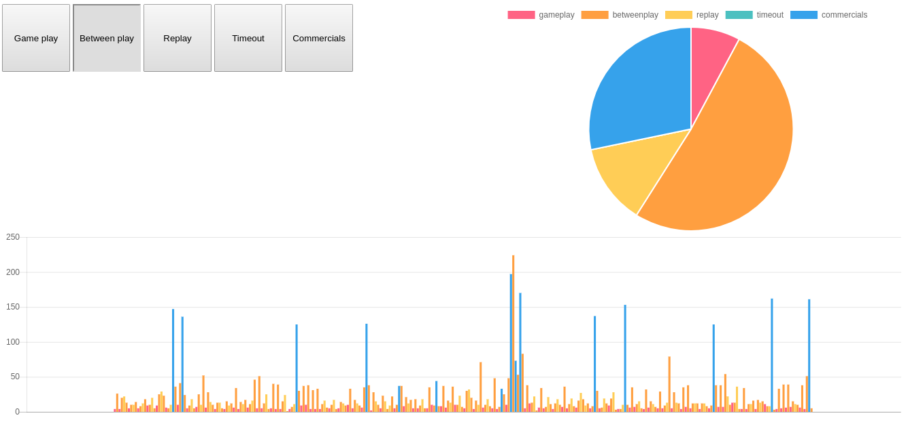

#### Screenshots

#### About

Football Timer is simple web tool, that allows you to track the amount of real gameplay during an NFL football game, aired on live TV.

#### Motivation

I created this tool to prove to a friend how little gameplay there actually was during a 3 hour airing of a professional football game.

#### Results

Here are the resulting times for coverage of *half* of a 3 hour long professional football game, during the 2nd and 3rd quarter.

Teams: Cincinnati Bengals @ Kansas City Chiefs
Time: 8:20pm airing

- Gameplay: 8m 25s
- Between play (timeouts, play resets, halftime show): 55m 5s
- Replays: 13m 45s
- Commercials: 30m 26s

Total time (2 quarters): 1h 47m 41s

#### Findings

- About 1/3 of the airing is commercials
- Almost twice as much time is spent reviewing replays of actual plays
- Only about 17 minutes of a 3 hour airing of an NFL game is actual gameplay action - not including pregame and postgame shows

#### Run

1. Open `index.html` in a browser.

#### Use

1. Click the timer button corresponding to the game state shown on TV.
	Click the button at the start of a change in state.
	- When the ball is in motion, click "Game play".
	- When a whistle sounds to end the play, click "Between play".
	- If a replay starts, click "Replay".
	- When a commercial blocks begins, click "Commercials".
2. See pie chart and bar chart updates in realtime.
3. Hover the pie chart and bar chart for statistics.

#### Dependencies

- Chart.JS
- Lodash
